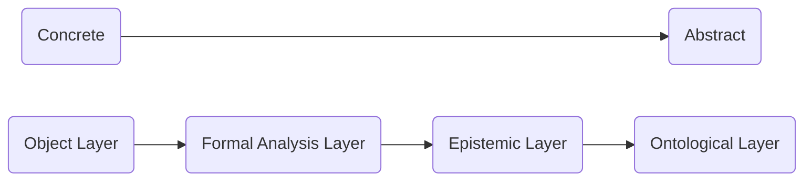

<p align="center">
  
</p>

# IN.IDEA: Iconographical Definitional Epistemological Architecture

**DOI: [10.5281/zenodo.18160255](https://doi.org/10.5281/zenodo.18160255)**

**A Graph Framework for Describing Visual Compositions and Modelling Uncertainty.**  
**Bridging the gap between flexible humanities research and high-performance data engineering.**

### Documentation & Repository Access

This project is optimized for an interactive documentation experience. 

* **Github Pages:** If you prefer Github Pages, please switch to [imagines-nummorum.github.io/idea-graph-framework/](https://imagines-nummorum.github.io/idea-graph-framework/).
* **Zenodo Users:** For the full interactive experience, latest updates, and proper navigation, please switch to our [GitHub Repository](https://github.com/imagines-nummorum/idea-graph-framework).

 
## Repository Structure

```text
.
├── docs/                # Detailed technical specifications (Architecture etc.)
├── modules/
│   ├── 00_core/         # The domain-agnostic engine (Cypher Statements, Fixtures)
│   ├── 05_ontology/     # Multi-language support and semantic metadata (WIP)
│   └── 10_numismatics/  # Domain extension for ancient coinage (WIP)
└── README.md            # This file

```
 
## Why IN.IDEA?

To investigate and search hundreds of thousands of coin datasets for our **[Imagines Nummorum](https://www.imagines-nummorum.eu/en)** project in real-time, we required a high-performance, scalable solution.

While **CIDOC CRM** remains the academic gold standard for linked data in cultural heritage, implementing it at this specific scale and complexity often results in systems that are practically unusable for high-speed querying. Furthermore, we needed a native way to model **scientific uncertainty and expert reasoning** — areas where current standards offer no satisfactory high-performance solutions.

**IN.IDEA is our tool, not our goal.** It was born out of the necessity to achieve a comprehensive iconographical and semantic indexing of ancient Greek coinage. We invite the community to join us on this 25-year mission (2025–2050) and to adapt or evolve our architecture for their own research needs.

 
## Empowering Research: From Observation to Insight

IN.IDEA is designed to act as a semantic workbench for scholars in numismatics, archaeology, and visual studies. It transforms static image descriptions into a dynamic, multidimensional knowledge graph.

### What can researchers do with IN.IDEA?
* **Complex Iconographical Queries:** Perform advanced searches that go beyond simple keywords. You can query specific scene structures, such as: "Show me all units where a deity (Entity) is holding (Relation) a weapon (Object)".
* **Modeling the "Maybe":** In the humanities, truth is rarely binary. IN.IDEA allows you to capture uncertainty by assigning certainty values (0.0–1.0) and documenting conflicting hypotheses or expert reasoning for every identification.
* **Separating Sight from Meaning:** Maintain a clean distinction between a neutral formal description (what is seen, the segment) and its epistemic interpretation (what it represents, the Platonic idea).
* **Tracking Provenance & Methodology:** Every statement is linked to an Agent (Human/AI), ensuring that the history of an interpretation is fully traceable and bibliographically grounded. Source References and Methological information enable detailled reasoning.
* **Flexible Ontological Mapping:** The framework is architecturally agnostic. While it serves as the foundation for the upcoming ThING (Thesaurus Iconographicus Nummorum Graecorum), you can model and plug in any hierarchical classification system or domain-specific ontology to meet your research requirements.
* **Quantifying Similarity:** Utilize the Hub-and-Spoke model to identify and quantify "diffuse" similarities between compositions that are difficult to capture through traditional direct edges.
* **Modular Extension Framework:** IN.IDEA is designed as a "lean", domain-agnostic core engine that can be easily extended to suit your specific research field. You can develop your own domain-specific modules or feature-rich extensions to add custom labels and properties without breaking the underlying four-layer logic.

 
## Technical Highlights

IN.IDEA is engineered for production-grade reasoning, moving beyond "traditional" academic graphs to a robust, scalable architecture.

### 1. Epistemic Reification (Solving the Provenance Problem)

Instead of modelling facts as binary edges, IN.IDEA reifies the act of interpretation as a first-class node (`Interpretation`):

* **Atomic Accountability:** Every semantic claim is a node, not a property on an edge, allowing for complex metadata (Certainty, Reasoning, Methodology) without "Property-Graph-Bloat".
* **Provenance Tracking:** Every semantic link carries metadata: `Agent` (Human/AI), `Methodology`, `Certainty` ( to ), and a `Reasoning Statement`.
* **Deterministic RAG:** Provides a high-fidelity roadmap for LLMs, mitigating hallucinations by forcing the model to traverse explicitly modeled uncertainty layers.

### 2. Deterministic Query Depth & Materialized Paths

Standard graph models often suffer from unpredictable traversal costs due to deep ontological recursions. IN.IDEA eliminates expensive `:IS_A*` lookups by materializing the hierarchy:

* **O(1) Hierarchy Checks:** Ancestral lookups in the concept tree are converted into simple array-membership checks using the `concept_path_ids` property.
* **Path-Length Invariant:** The distance from a physical `Unit` to its semantic `Concept` is structurally capped (e.g., 4 for Entities, 6 for Events).
* **Performance Guarantee:** By fixing traversal depth and materializing hierarchical paths, the model achieves near-constant *O*(1) vertical traversal complexity relative to the schema depth and *O*(log n) lookup efficiency, ensuring native compatibility with horizontally scalable graph engines.

### 3. Linear Complexity Similarity (*O*(n) Scaling)

To avoid the *O*(n²) "dense graph" trap where edges grow exponentially, IN.IDEA utilizes a **Centroid-based Hub-and-Spoke model**:

* **Topological Compression:** Diffuse similarity is managed via `CompositionParallel` hubs rather than direct edges between compositions.
* **Resource Efficiency:** This reduces edge density by orders of magnitude, allowing the system to handle many compositions on commodity hardware without index collapse.

### 4. Relational Single Source of Truth (SSoT)

IN.IDEA is designed as a strict **Read-Optimized Projection** of a normalized relational database:

* **Integrity-First:** The graph layer acts as a high-performance materialized view, ensuring ACID compliance and formal data integrity at the source.
* **Traceability:** Every node carries a unique identifier (`_id`) mapped directly from the relational SSoT primary keys.

 
## The Four-Layer Architecture



The framework distinguishes between observation and interpretation through a strict four-layer logic:

| Layer | Focus | Key Nodes |
| --- | --- | --- |
| **I: Object** | Physical/Virtual Object/Carrier | `Unit` |
| **II: Formal Analysis** | Structural Primitives (Neutral) | `Composition`, `Entity`, `Relation` ... |
| **III: Epistemic** | Uncertainty & Reasoning | `Interpretation`, `Source`, `Agent`, `Comparison` |
| **IV: Ontological** | Abstract Concepts (ThING) | `Concept` |
 

## Getting Started

To understand the core logic and explore the graph, we recommend the following paths:

### 1. Essential Reading (Theory & Data)

Before diving into the code, please review these documents to understand the epistemic and structural foundations:

* **[Architecture Overview](docs/01_architecture.md):** Learn about the four-layer logic, epistemic reification, and the performance-centric design philosophy.
* **[Core Fixtures](modules/00_core/fixtures.md):** Understand how abstract concepts are instantiated. This document includes references to visualizations of the example scenarios.

### 2. Hands-on: Running the Sandbox

For a live demonstration of the IN.IDEA framework, we provide a pre-configured Docker environment that automatically seeds the graph with our core logic and test data.
**Important Note:** This Docker setup is intended for local demo and development purposes only. It is not hardened for production environments.

1. **Set up the Environment:** if you need to change default password or ports, run `cp .env.example .env` and edit the related keys. 
2. **Run the docker command:** `docker-compose up` and wait for the seeding to be completed
3. **Access the Neo4j Browser:** Open your browser and navigate to **`http://localhost:7474`** (User: noe4j, PW: password).
  * The seeder has already loaded the constraints, indices, and fixtures from the `modules/00_core` directory.
  * You can immediately run the examples from **[queries.md](modules/00_core/queries.md)** in the Neo4j Browser.
4. **Reset:** use `docker-compose down -v` to revert any changes to the data

If you want to build some datasets on you own, we recommand reading at least **[how-to-annotate-using-in-idea.md](docs/03_how-to-annotate-using-in-idea.md)** and **[nodes-and-edges.md](modules/00_core/nodes-and-edges.md)**.
 
## Author & Governance

IN.IDEA is open-sourced software created and maintained by [Jan Köster](https://orcid.org/0000-0003-2713-5207) and licensed under the [Apache 2.0 license](LICENSE.txt) for the Academy Project ["Imagines Nummorum"](https://www.bbaw.de/en/research/imagines-nvmmorvm-thesaurus-iconographicus-nummorum-graecorum-online) at the [Berlin-Brandenburg Academy of Sciences and Humanities](https://www.bbaw.de/en/). This project  is part of the "Akademienprogramm", funded by German federal and state governments, which serves to preserve, secure and make present our cultural heritage.
It is coordinated by the [Union of German Academies of Sciences and Humanities](https://www.akademienunion.de/).

**Contact:** For any IN.IDEA related topic we prefer direct communication on Github, for any contact to our initiative, see [Contact](https://www.imagines-nummorum.eu/en/contact)

## Citation

```bibtex
@software{koester_jan_2026_IN_IDEA,
  author       = {Köster, Jan},
  title        = {{IN.IDEA: A Graph Framework for Describing Visual 
                   Compositions and Modelling Uncertainty}},
  month        = jan,
  year         = 2026,
  publisher    = {Zenodo},
  version      = {v0.9.3},
  doi          = {10.5281/zenodo.18160255},
  url          = {https://doi.org/10.5281/zenodo.18160255}
}

```

## AI Transparency & Methodology

In alignment with the epistemological focus of this project, transparency regarding the creation process is paramount. This graph model was developed with the assistance of **Google Gemini** (v2.5 Flash and 3 Pro), which served as an interactive dialogue partner and research tool.

The AI's contribution included the following areas:

* **Conceptual Brainstorming:** Exploratory dialogue to refine the concept of the model.
* **Best Practices Integration:** Research and suggestions for adapting established patterns from graph theory and Neo4j.
* **Coherence Validation:** Reviewing and stress-testing the consistency of the terminology and structural logic used in the graph.
* **Drafting Support:** Generating initial outlines and structural sketches for the publication/documentation.

**Note on Authorship:**
While the AI provided support as described above, all final decisions, code implementations, and text formulations were curated, verified, and finalized by the maintainer mentioned above. The AI acted solely as an assistive tool, not as an autonomous agent/co-author.

## Nomenclature & Roots

This framework is officially titled IN.IDEA.
The name is a functional synthesis:
* **IN:** Relfects the primary domain of application (Imagines Nummorum)
* **IDEA:** An acronym for Iconographical Definitional Epistemological Architecture, describing the underlying logical framework for graph-based knowledge representation.

**Note:** This software is independent and not affiliated with any brand including the word or acronym *idea*. It is a non-commercial, research-driven, open-sourced software architecture.
