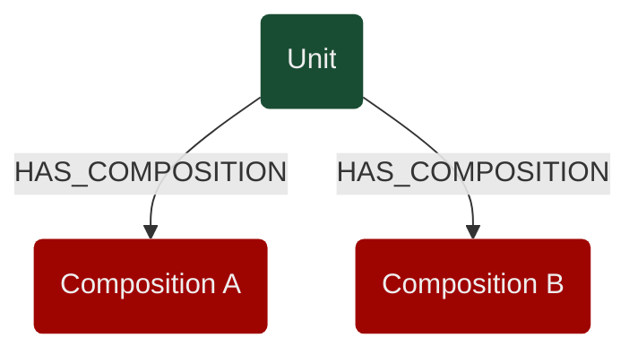
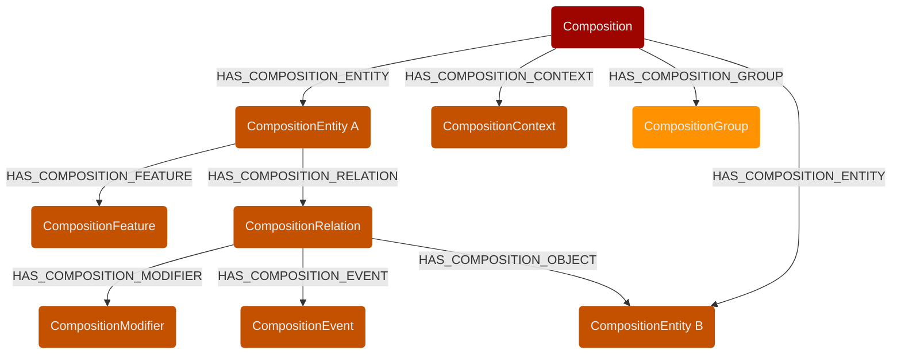
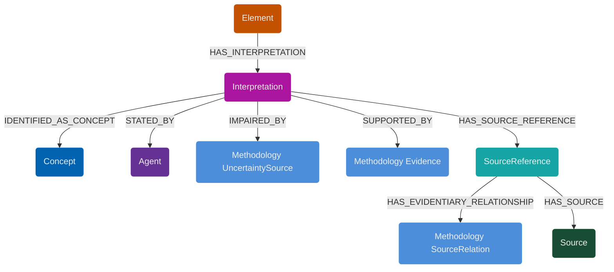
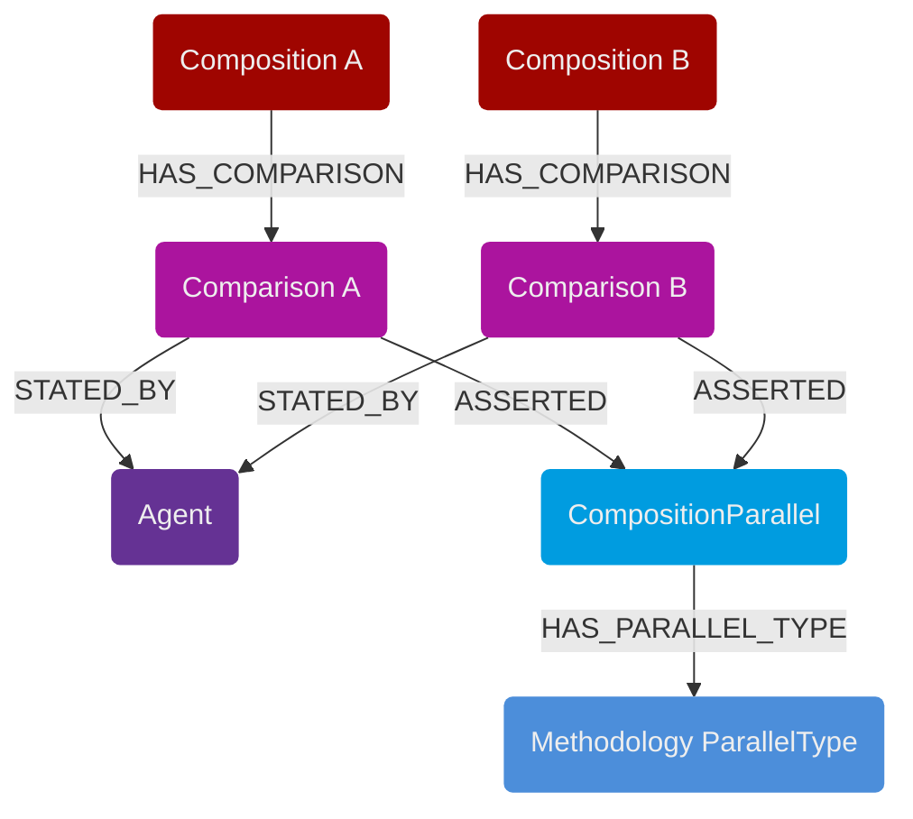
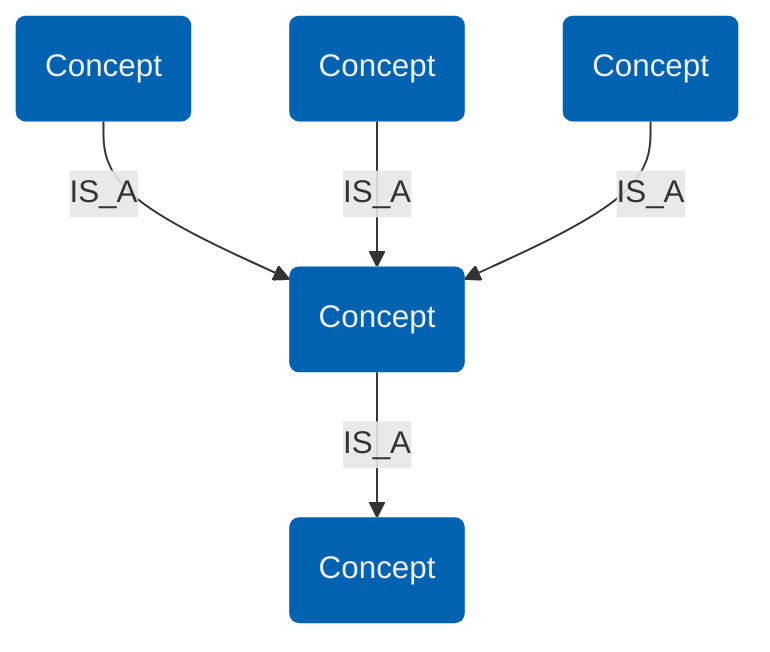

# IDEA: Architectural Overview

## 1. Design Philosophy

The development of IDEA is designed to bridge the gap between flexible humanities research and high-performance data engineering:

* **Epistemic Primacy (Modeling the "Maybe"):** Unlike traditional models that force reality into binary 1s and 0s, IDEA treats interpretation as a first-class citizen. By reifying the interpretive act into its own node, we allow for the structured representation of uncertainty, conflicting hypotheses, and expert reasoning. Diffuse similarity between objects is modeled via **centroid-structures (Hub-and-Spoke)** rather than direct edges, enabling nuanced similarity quantification.
* **Relational-to-Graph Integrity:** IDEA is designed as a strict Read-Optimized Projection of a relational database (Single Source of Truth, e.g., PostgreSQL). Every node, edge, and property in the graph must have a schematic counterpart in the relational model. This prevents "schema-less sprawl" and ensures that the data remains verifiable, migratable, and strictly typed. In production we will operate on a strict "Schema-on-Write" principle during the ETL process.
* **Horizontal Scalability & Performance-Centric Flatness:** The graph is engineered to grow in "width" (number of units) rather than "depth" (traversal length). To ensure O(1) or O(log n) performance for complex queries, the depth from a physical unit to an ontological concept is fixed (typically 4 to 6 hops). Deep ontological recursions are bypassed by **materializing hierarchy paths** directly as node properties. See **[performance-and-scaling.md](02_performance-and-scaling.md)**
* **Modular Framework Design:** The framework distinguishes between the **IDEA Core** — a lean, domain-agnostic engine for formal analysis —, **Core Extensions** (e.g., for ontology management) and specialized **Domain Extensions** (e.g., `IDEA Numismatics`). Our "Golden Rule" states: *Modules may extend the Core with specialized labels or properties, but they must never alter the fundamental four-layer logic or the core edge directionality (from concrete to abstract).*
* **Multi-Modal Readiness:** While the current implementation focuses on static visual media (coins, stelae, paintings), the underlying logic of distinguishing between objects, formal elements, epistemic interpretations and concepts is intentionally medium-agnostic. The architecture is prepared for future expansions into moving images, complex 3D objects, or textual analysis.

---

## 2. Style and Conventions

| Element | Convention | Example |
| --- | --- | --- |
| **Labels (Nodes)** | PascalCase | `CompositionEntity`, `AIAgent` |
| **Properties** | lower_snake_case | `reasoning_statement`, `certainty` |
| **Edges** | UPPER_SNAKE_CASE | `IDENTIFIED_AS_CONCEPT` |
| **Uniqueness** | `_id` suffix | `unit_id`, `concept_id` |

**ID Strategy**: Every node carries a unique identifier (_id) mapped directly from the relational SSoT primary keys. This ensures 1:1 traceability between the graph projection and the SQL source. Please note: the fixtures are populated with string-based identifiers for easier navigation in the Neo4j Browser.

---

## 3. The Atomic Core Elements

To maintain semantic precision across all layers, IDEA utilizes seven core categories. These categories are used to define visual elements, abstract patterns, and ontological concepts:

* **Entity:** Any discrete being or object (concrete or abstract).
* **Feature:** Attributes, states, or typographic properties belonging to an Entity.
* **Relation:** Directed atomic actions or relationships between two Entities.
* **Modifier:** Specific details describing the execution of a Relation (e.g., handedness).
* **Event:** Macro-level actions composed of multiple atomic Relations.
* **Context:** References to external frameworks like mythology, history, or publication contexts.
* **Group:** Logical containers or spatial regions (e.g., a text block or a logical arrangement). (no Concept)

---

## 4. The Four-Layer Architecture

The Four-Layer Architecture is the backbone of the IDEA Core

### Layer I: Object Layer

Represents the physical or virtual object (e.g., a specific coin) which has one or more `Composition` (Layer II).

* **Nodes:** `Unit`.

### Layer II: Formal Analysis Layer (Description)

A structural decomposition of the image in functional primitives.

* **Nodes:** `Composition`, `CompositionEntity`, `CompositionFeature`, `CompositionRelation`, `CompositionModifier`, `CompositionEvent`, `CompositionGroup`, `CompositionContext`.
* **Logic:** Captures *what* is seen without assigning final meaning.

### Layer III: Epistemic Layer 

### A) Interpretation / Uncertainty and Reasoning

The core of IDEA’s uncertainty modeling. No semantic link exists without an intermediate interpretation node.

* **Nodes:** `Interpretation`, `Reading`, `SourceReference`, `Source`, `Agent`, `Architectonic`.
* **Uncertainty:** Stores `certainty` values (float) and expert reasoning.
* **Provenance:** `Agent` nodes identify the author (Human/AI), while `Source` and `SourceReference` provide bibliographic evidence.
* **Methodology:** `Architectonic` nodes define the meta-ontology of the interpretation (e.g., "Logical Deduction" or "Ambiguity").

### B) Similarity 

To model "diffuse" similarity between images without creating direct edges, IDEA uses a Hub-and-Spoke model. “Diffuse” refers to similarities that are difficult or impossible to model in the structure of the graph because the concepts involved are too far apart.

* **Hub:** `CompositionParallel`.
* **Mechanism:** Multiple `CompositionComparison` nodes point to a single `Parallel` hub with aggregated properties (assertion count, similarity average and deviation).
* **Benefit:** Reduces edge density significantly while allowing complex similarity quantification.

### Layer IV: Ontological Layer

#### A) Concepts

Defines the abstract world of concepts.

* **Nodes:** `Concept`, `Pattern`, `PatternEntity`, `PatternRelation`.
* **Concepts:** An abstract hierarchy of lemmas (Entity, Relation, etc.) used for classification. 
* **Core Limitation:** To maintain domain-agnosticism and high performance, the IDEA Core treats Concepts as structural anchors with minimal properties (primarily `concept_id`).
* **Extension - Module 05_ontology:** For human-readable labels, multi-language support, and detailed definitions, the Core is extended by the **Ontology Module**. This module handles the semantic "flesh" of the ThING, allowing the Core to remain a lean navigational skeleton (Work in Progress).

#### B) Patterns

Patterns Act as **Presets** and **Filters**. They provide an iconographical blueprint (e.g., "Human holding object") to quickly find all Compositions matching a specific scene structure without diving into detailed analysis. They work like a reduced Layer II. They are linked via an Interpretation node directly to the compositions. Within the pattern description there are no interpretation nodes since they are already operating on the abstract, "idle" Level of Concepts.

---

## 5. High-Performance Design Patterns

### Linear Scaling & Fixed Traversals

The model is optimized for very large datasets (hundreds of thousands of compositions).

* **Width over Depth:** Adding new compositions increases the "width" of the graph. The "depth" (hops from Unit to Concept) remains constant.
* **O(1) Hierarchy Checks:** Using materialized path arrays (`concept_path_ids`), ancestral lookups in the concept tree are converted into simple array-membership checks. see **[performance-and-scaling.md](02_performance-and-scaling.md)**.
  * To find a Unit with a specific Entity/Context: Unit -> Composition -> CompositionEntity/CompositionContext -> Interpretation -> Concept (5 Hops)
  * To find a Unit with a specific Feature/Relation: Unit -> Composition -> CompositionEntity -> CompositionFeature -> Interpretation -> Concept (6 Hops)
  * To find a Unit with a specific Modifier/Event: Unit -> Composition -> CompositionEntity -> CompositionRelation -> CompositionModifier/CompositionEvent -> Interpretation -> Concept (7 Hops)
