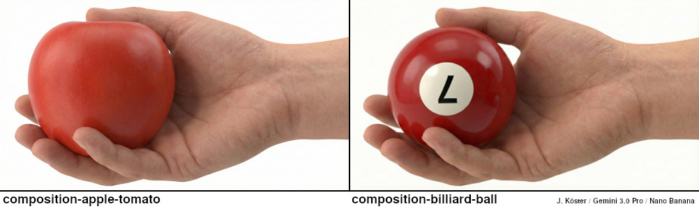

# Core Assets

To understand the structural logic of IDEA, we provide both static visual examples and interactive model diagrams.

Figure 1: Visual representation of the composition-apple-tomato and composition-billiard-ball test cases.

The provided Neo4j Docker setup loads the fixtures directly into the database during startup. Alternatively, you can also find SVGs or JSON exports for [Arrows.app](https://arrows.app) here. 

* "Apple-Tomato" Analysis: [SVG](apple-tomato_analysis.svg) | [JSON](apple-tomato_analysis.json)
* "Apple-Tomato" Epistemic Layer: [SVG](apple-tomato_epistemic-layer.svg) | [JSON](apple-tomato_epistemic-layer.json)
* "Billiard Ball" Analysis: [SVG](billiard-ball_analysis.svg) | [JSON](billiard-ball_analysis.json)
* "Billiard Ball" Epistemic Layer: [SVG](billiard-ball_epistemic-layer.svg) | [JSON](billiard-ball_epistemic-layer.json)
* Patterns: [SVG](patterns.svg) | [JSON](patterns.json)
* Comparisons: [SVG](comparisons.svg) | [JSON](comparisons.json)